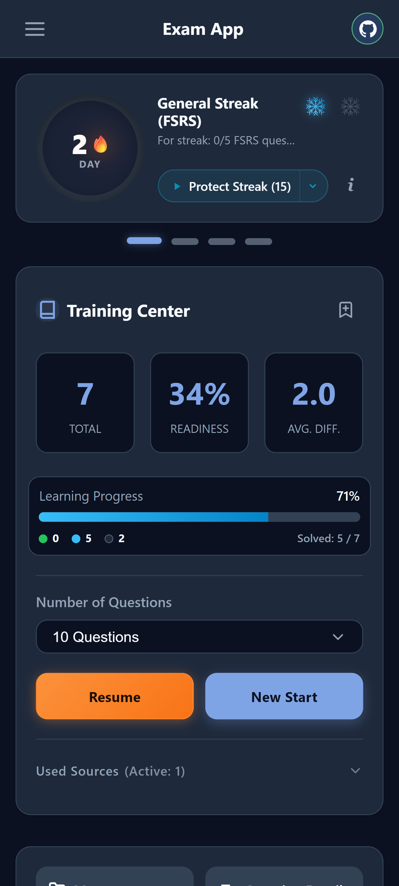
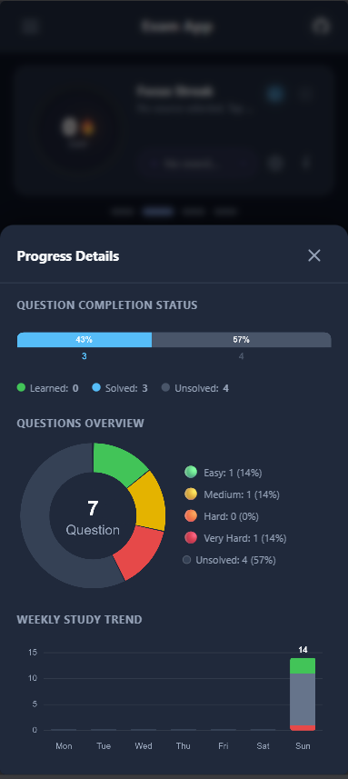
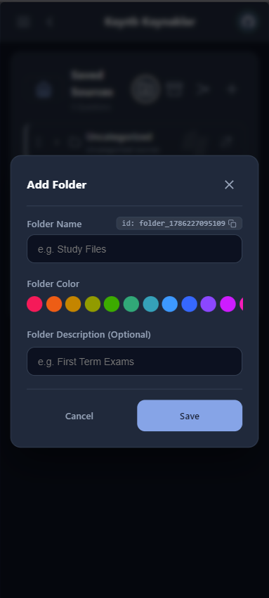
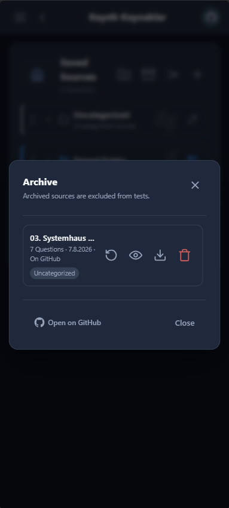
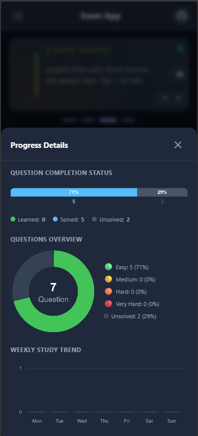

# Exam App

[](https://exam.rifatarslan.dev/)
[](https://github.com/tafirnat/exam-app/actions/workflows/deploy.yml)


**Offline-first, personal, private exam & flashcard app with cross-device sync — no account, no subscription, no third-party data tracking.**

Exam App lets you turn any study material into interactive quizzes and flashcards. It remembers which questions you struggle with and schedules them for review at the right time, using the science-backed FSRS spaced repetition algorithm. Your data stays locally on your device by default, with optional seamless cross-device synchronization (PC, phone, tablet) managed entirely under your control via your own private GitHub Gist.

> Just want to try it? **<a href="https://exam.rifatarslan.dev/" target="_blank" rel="noopener noreferrer">Open the live demo →</a>**

---

## Languages / Diller / Sprachen

> **Note**: The **English** version (`README.md`) is the **primary original source**.
>
> **Read in other languages:**
> - **[Türkçe README](./README.tr.md)**
> - **[Deutsch README](./README.de.md)**

---

## Who Is This For?

Exam App is built for anyone who learns from their own material:

- **Students** preparing for university, professional, or language certification exams
- **Self-learners** who keep notes in Obsidian or similar Markdown tools and want to turn them into practice tests
- **Anyone** who wants a distraction-free, data-sovereign alternative to Anki, Quizlet, or similar apps — without subscriptions or cloud lock-in

---

## Features

### 7 Question Types — All in One App

- **Single Choice** — standard multiple-choice with one correct option
- **Multiple Choice** — two or more correct selections required
- **True / False** — binary statement verification
- **Short Answer** — type the exact answer; supports multiple accepted variants and optional case-sensitivity
- **Fill in the Blank** — keywords embedded inline via `{{blank}}` or `{{canonical|alternative}}`
- **Flashcard** — classic flip card with self-rated retention
- **Reading Material** — rich Markdown study notes, no grading pressure *(alias: `topic_review`)*

### Intelligent Spaced Repetition (FSRS v5)

Questions you find hard come back sooner. Questions you know well are spaced further apart. The FSRS v5 algorithm — the same engine used by Anki — adapts review intervals to your actual memory, not a fixed timetable.

### One-Tap Daily Review

A streak card on the home screen shows how many questions are due today based on your FSRS schedule. Tap once to start — no source hunting required. Choose between **pure FSRS order** (most urgent first) or **grouped by source/folder** for context-aware studying.

### Streak & Continuity Tracking

A global study streak counts consecutive active days. An automatic **freeze buffer** silently forgives up to 2 missed days per week — a busy day won't break your streak.

### Focus Pools

Pin up to 3 sources or folders as daily focus pools with a custom question target (1–5 per pool, 15 total max). These questions are quietly blended into your daily FSRS session when they aren't already due — no forced quotas, no guilt-tripping.

### Quick Insights (Nuggets)

Not all learning happens through testing. Quick Insights allow you to capture the core essence of a topic—its "nugget" of truth—without the pressure of a question-and-answer format. They appear gracefully in the continuity stream while you study, providing a distraction-free way to absorb critical concepts. You can also prompt the AI to generate these insights to distill complex questions into bite-sized facts.

### Folder & Archive Management

Organize sources into color-labeled folder hierarchies. Archive individual sources or entire folders to pause them — the FSRS clock **freezes while archived**, so restoring a large archive never floods your daily queue with overdue cards all at once.

### Progress Analytics

- **Activity Heatmap** — GitHub-style daily activity grid, color-coded by dominant folder
- **Weekly & Monthly Trend Charts** — bar charts showing study volume over time
- **Per-Question Analytics** — full history, retrievability score, and difficulty for every question
- **Detailed Source Breakdown** — active vs. archived sources with question counts at a glance

### Smart Push Notifications

Opt-in daily reminders that fire once per day when cards are due. Permission is requested only after a successful study session — never at first launch. Configurable quiet hours (default: 22:00–08:00).

### Onboarding Guide

An interactive step-by-step tour walks you through the app's key features on first launch, or any time from the settings menu.

### Multilingual Interface

Full UI in **English**, **Turkish**, and **German**. Integrated Google Translate support for translating question content into 10+ languages.

### AI Integration

- **Generate question sets**: Use the included prompt ([AI_AGENT_PROMPT.md](./AI_AGENT_PROMPT.md)) with ChatGPT, Claude, or Gemini to convert any text into Exam App JSON.
- **Folder-targeted generation**: Include `"folderId": "folder_..."` in the JSON root to automatically place imported question banks inside a specific folder (copy folder IDs via the `id: ...` button in the folder management modal).
- **Sequential Order (`keepOrder`)**: For sequential reading materials or ordered topics, add `"keepOrder": true` (or `"preserveOrder": true`) in the JSON root or `exam_metadata` to prevent question shuffling. You can also toggle this anytime using the **Sequential** button in Source Actions.
- **Ask AI about a question**: Send any question's context to ChatGPT, Claude, Gemini, DeepSeek, Kimi, etc. in one click, in your active UI language.

### Text-to-Speech

Reads questions and reading cards aloud using native browser speech synthesis. Adjustable speed (×0.7–×1.3), autoplay on navigation, floating playback controls.

### Data Sovereignty & BYOC (Bring-Your-Own-Cloud)

No third-party tracking servers or central databases. No forced accounts or subscription fees. Your study data is stored locally on your device by default. Cross-device synchronization is handled via **your own private GitHub Gist**, acting as a personal, free cloud backend. This ensures your data remains exclusively in your own GitHub account and under your control.

---

## Screenshots

<div align="center">

### Dashboard & Progress
| Dashboard | Progress Details |
| :---: | :---: |
|  |  |

### Quiz Interface & Results
| Active Quiz Session | Test Results & Analysis |
| :---: | :---: |
|  |  |

### Source Management & Navigation
| Saved Sources & Folders | Sidebar Menu & Quick Actions |
| :---: | :---: |
|  |  |

### Organization & Archiving
| Add Folder | Archive Source |
| :---: | :---: |
|  |  |

### Detailed Analytics
| Question Analytics |
| :---: |
|  |

</div>

---

## Cross-Device Sync (GitHub Gist)

Sync all your question banks, progress, statistics, notes, and preferences across devices without a third-party server:

1. **Create a GitHub Token**
   - Go to [GitHub Token Settings](https://github.com/settings/tokens?type=beta)
   - Create a Fine-grained token with **Gists: Read and Write** permissions
2. **Connect in App**
   - Click the **GitHub** button in the header, paste your token, and click **Connect & Sync**
3. **Automatic Background Sync**
   - The app automatically creates a secret Gist (`exam_app_backup.json`) and syncs in the background
   - Archived items sync separately (`exam_app_archive.json`) to keep daily sync lightweight

### Companion Obsidian Plugin

If you prepare questions in Obsidian, the **[Obsidian ExamApp Gist Sync](https://github.com/tafirnat/Obsidian-ExamApp-Sync)** plugin syncs your Obsidian vault directly with Exam App via Gist.

---

## Getting Started

The easiest way to use Exam App is the **<a href="https://exam.rifatarslan.dev/" target="_blank" rel="noopener noreferrer">hosted live demo</a>** — no installation needed. The app is a fully static, offline-capable PWA that can also be installed on your phone or desktop directly from the browser.

To load your own questions, use the **Add Source** button on the home screen to import a JSON file. See the [JSON schema guide](./public/examples/schema-guide.md) for the data format, or use the [AI prompt](./AI_AGENT_PROMPT.md) to generate question sets automatically.

---

## AI Question Set Generation

Convert any textbook, article, or lecture note into Exam App JSON:

1. Open **[AI_AGENT_PROMPT.md](./AI_AGENT_PROMPT.md)** and copy the instructions
2. Paste the prompt along with your study material into ChatGPT, Claude, Gemini, or DeepSeek
3. Import the generated JSON directly into Exam App

---

## Data Format & JSON Schema

Exam App uses a clean, human-readable JSON schema consisting of `exam_metadata` and a `questions` array. Exam identifiers (`id`) are preserved in an immutable **Hybrid ID** format (`exam_[slug]_[timestamp/hash]`) to prevent cross-device sync collisions.

```json
{
  "exam_metadata": {
    "title": "Computer Networks 101",
    "id": "exam_computer_networks_101_1785739334",
    "category": "Computer Science",
    "description": "Fundamental networking protocols and concepts."
  },
  "questions": [
    {
      "id": "q1",
      "type": "single_choice",
      "difficulty": 2.0,
      "tags": ["web", "protocols"],
      "content": { "text": "Which HTTP status code means **Not Found**?" },
      "options": [
        { "id": 1, "text": "200 OK" },
        { "id": 2, "text": "404 Not Found" },
        { "id": 3, "text": "500 Internal Server Error" }
      ],
      "answer": {
        "correct_ids": [2],
        "explanation": "The `404 Not Found` status code indicates that the server cannot find the requested resource."
      }
    }
  ]
}
```

*See **[AI_AGENT_PROMPT.md](./AI_AGENT_PROMPT.md)** and **[schema-guide.md](./public/examples/schema-guide.md)** for full schema specifications.*

---

## Technical Architecture

### Tech Stack

- **Vanilla JS (ES Modules) & HTML5** — Zero framework overhead; modular architecture with tree-shakeable imports
- **Custom CSS** — Framework-free design system using CSS custom properties for glassmorphic dark/light themes
- **Vite + `vite-plugin-singlefile`** — Bundles all JS, CSS, and assets into a single self-contained `index.html`
- **Browser `localStorage`** — All state is kept client-side; no backend required
- **GitHub Gist REST API** — Optional cross-device sync via the user's private Gist
- **Service Worker (PWA)** — Offline support and push notification scheduling

### Core Algorithms

- **FSRS v5** — Free Spaced Repetition Scheduler for memory-adapted review intervals
- **Archive FSRS Freezing** — Time spent in archive does not count against question schedules; restoring large archives never floods your queue

---

## Local Development

### Prerequisites

- Node.js (v18 or higher)
- npm

### Installation

```bash
git clone https://github.com/tafirnat/exam-app.git
cd exam-app
npm install
```

### Dev Server

```bash
npm run dev
```

### Build

```bash
npm run build
```

The single-file production build will be generated in `dist/index.html`.

---

## CI/CD & Deployment

Every commit to `main` triggers a GitHub Actions workflow ([deploy.yml](.github/workflows/deploy.yml)) that runs a Vite single-file build and deploys `dist/index.html` to **GitHub Pages** (`gh-pages` branch).

---

## Development & Acknowledgments

Designed and built with contributions from AI coding assistants Antigravity and Claude.

---

## License

Distributed under the **MIT License**. See [LICENSE](LICENSE) for more information.

---
Created by [tafirnat](https://github.com/tafirnat)
