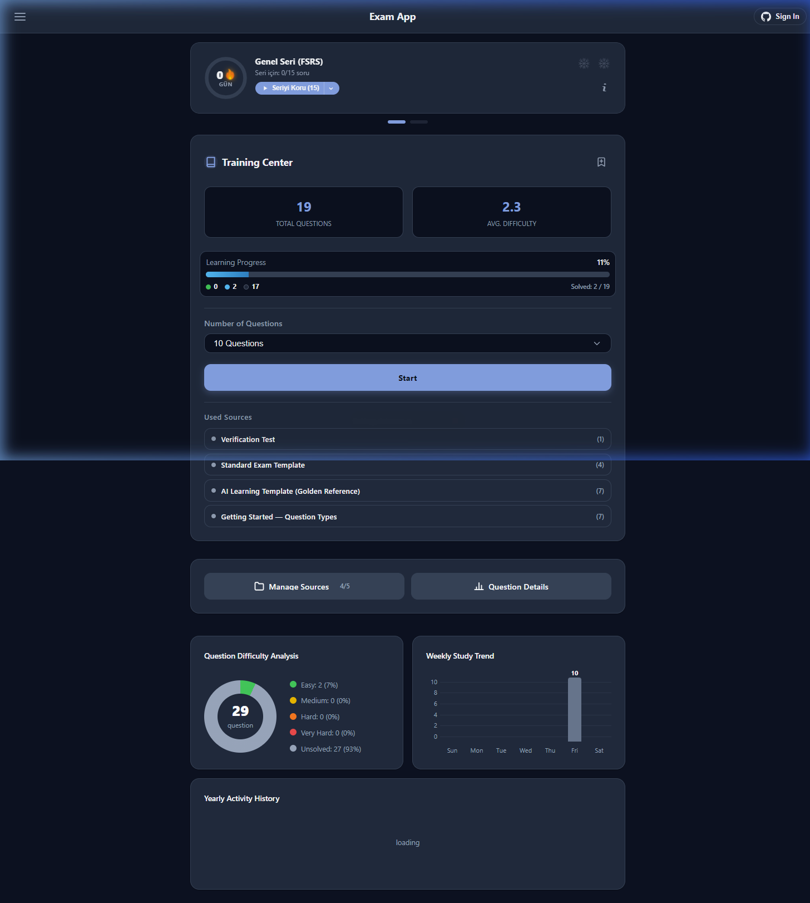
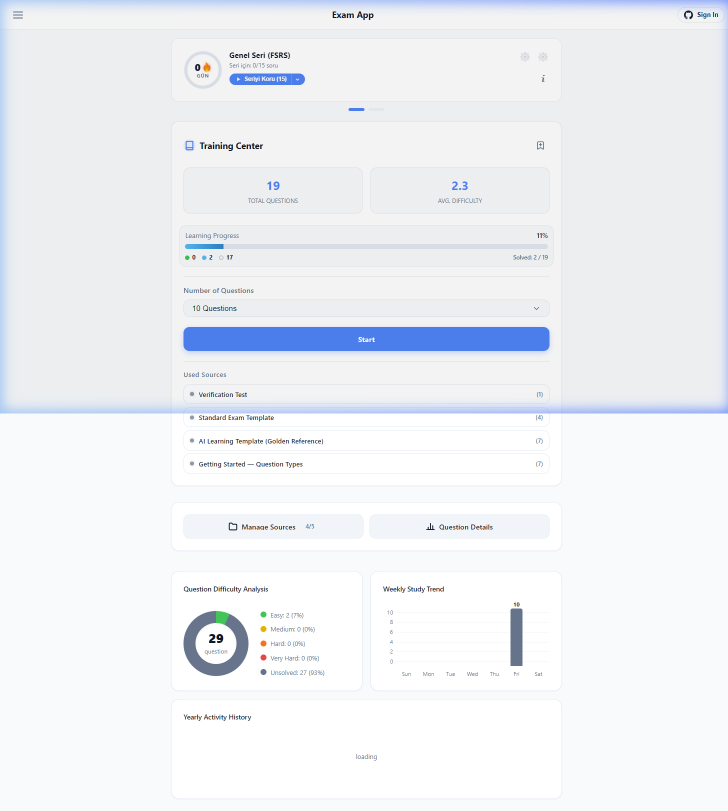
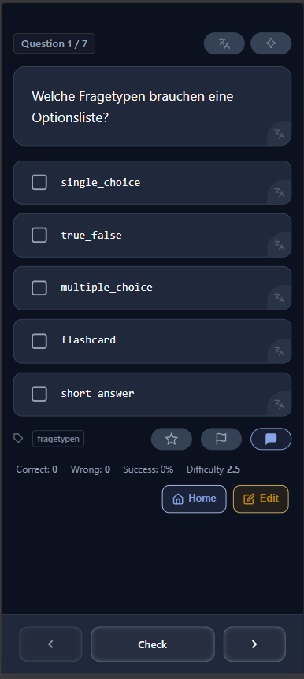
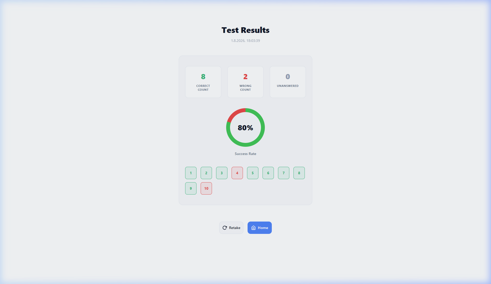
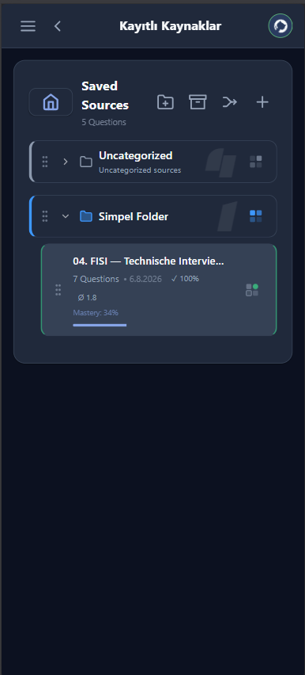
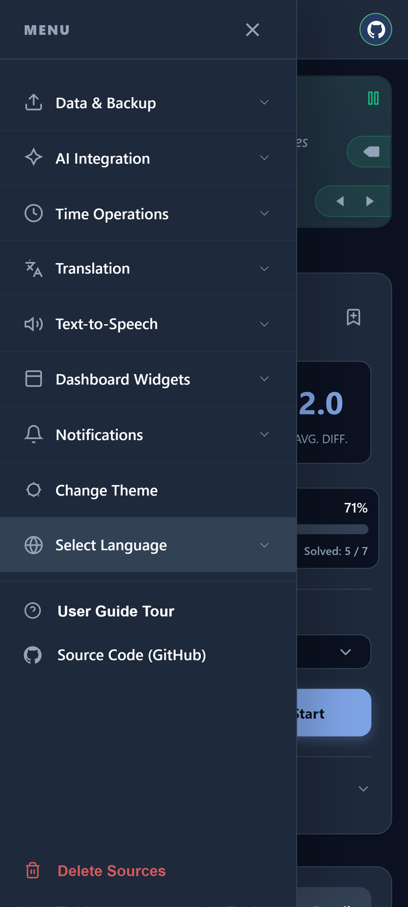
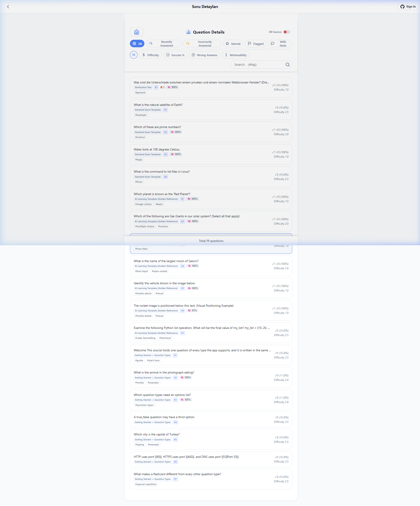

# 🎓 Exam App

[](https://exam.rifatarslan.dev/)
[](https://github.com/tafirnat/exam-app/actions/workflows/deploy.yml)


**Your personal, private exam & flashcard app that works 100% offline — no account, no subscription, no data sent to any server.**

Exam App lets you turn any study material into interactive quizzes and flashcards. It remembers which questions you struggle with and schedules them for review at the right time, using the science-backed FSRS spaced repetition algorithm. Everything stays on your device (or optionally syncs to your own private GitHub Gist).

> 💡 Just want to try it? **[Open the live demo →](https://exam.rifatarslan.dev/)**

---

## 🌐 Languages / Diller / Sprachen

> ℹ️ **Note**: The **English** version (`README.md`) is the **primary original source**.
>
> 🌐 **Read in other languages:**
> - 🇹🇷 **[Türkçe README](./README.tr.md)**
> - 🇩🇪 **[Deutsch README](./README.de.md)**

---

## 🤔 Who Is This For?

Exam App is built for anyone who learns from their own material:

- 📚 **Students** preparing for university, professional, or language certification exams
- 🧠 **Self-learners** who keep notes in Obsidian or similar Markdown tools and want to turn them into practice tests
- 🔁 **Anyone** who wants a distraction-free, privacy-first alternative to Anki, Quizlet, or similar apps — without subscriptions or cloud lock-in

---

## ✨ What Can It Do?

### 📋 7 Question Types — All in One App

- **Single Choice** — standard multiple-choice with one correct option
- **Multiple Choice** — two or more correct selections required
- **True / False** — binary statement verification
- **Short Answer** — type the exact answer; supports multiple accepted variants and optional case-sensitivity
- **Fill in the Blank** — keywords embedded inline via `{{blank}}` or `{{canonical|alternative}}`
- **Flashcard** — classic flip card with self-rated retention
- **Reading Material** — rich Markdown study notes, no grading pressure *(alias: `topic_review`)*

### 🧠 Intelligent Spaced Repetition (FSRS v4.5)

Questions you find hard come back sooner. Questions you know well are spaced further apart. The FSRS v4.5 algorithm — the same engine used by Anki — adapts review intervals to your actual memory, not a fixed timetable.

### ⚡ One-Tap Daily Review

A streak card on the home screen shows how many questions are due today based on your FSRS schedule. Tap once to start — no source hunting required. Choose between **pure FSRS order** (most urgent first) or **grouped by source/folder** for context-aware studying.

### 🔥 Streak & Continuity Tracking

A global study streak counts consecutive active days. An automatic **freeze buffer** silently forgives up to 2 missed days per week — a busy day won't break your streak.

### 📌 Focus Pools

Pin up to 3 sources or folders as daily focus pools with a custom question target (1–5 per pool, 15 total max). These questions are quietly blended into your daily FSRS session when they aren't already due — no forced quotas, no guilt-tripping.

### 📁 Folder & Archive Management

Organize sources into color-labeled folder hierarchies. Archive individual sources or entire folders to pause them — the FSRS clock **freezes while archived**, so restoring a large archive never floods your daily queue with overdue cards all at once.

### 📊 Progress Analytics

- **Activity Heatmap** — GitHub-style daily activity grid, color-coded by dominant folder
- **Weekly & Monthly Trend Charts** — bar charts showing study volume over time
- **Per-Question Analytics** — full history, retrievability score, and difficulty for every question
- **Detailed Source Breakdown** — active vs. archived sources with question counts at a glance

### 🔔 Smart Push Notifications

Opt-in daily reminders that fire once per day when cards are due. Permission is requested only after a successful study session — never at first launch. Configurable quiet hours (default: 22:00–08:00).

### 🚀 Onboarding Guide

An interactive step-by-step tour walks you through the app's key features on first launch, or any time from the settings menu.

### 🌐 Multilingual Interface

Full UI in **English**, **Turkish**, and **German**. Integrated Google Translate support for translating question content into 10+ languages.

### 🤖 AI Integration

- **Generate question sets**: Use the included prompt ([AI_AGENT_PROMPT.md](./AI_AGENT_PROMPT.md)) with ChatGPT, Claude, or Gemini to convert any text into Exam App JSON.
- **Folder-targeted generation**: Include `"folderId": "folder_..."` in the JSON root to automatically place imported question banks inside a specific folder (copy folder IDs via the `id: ... 📋` button in the folder management modal).
- **Ask AI about a question**: Send any question's context to ChatGPT, Claude, Gemini, DeepSeek, Kimi, etc. in one click, in your active UI language.

### 🔊 Text-to-Speech

Reads questions and reading cards aloud using native browser speech synthesis. Adjustable speed (×0.7–×1.3), autoplay on navigation, floating playback controls.

### 🔒 100% Private — Zero Backend

No servers. No accounts. No subscription. Study data lives in your browser's `localStorage`. Optional cross-device sync via your own private GitHub Gist.

---

## 📸 Screenshots

<div align="center">

### 🏠 Dashboard & Daily Review

| Light Mode | Dark Mode |
| :---: | :---: |
|  |  |

### 📝 Quiz Interface & Results

| Active Exam Session | Test Results & Analytics |
| :---: | :---: |
|  |  |

### 📂 Source Management & Navigation

| Saved Sources & Folders | Sidebar Menu & Quick Access |
| :---: | :---: |
|  |  |

### 📊 Detailed Question Analytics

| Question Details & History |
| :---: |
|  |

</div>

---

## ☁️ Cross-Device Sync (GitHub Gist)

Sync all your question banks, progress, stats, notes, and preferences across devices — without any third-party server:

1. **Generate a GitHub Token**
   - Go to [GitHub Token Settings](https://github.com/settings/tokens?type=beta)
   - Create a Fine-grained token with **Gists: Read and Write** permissions
2. **Connect in the App**
   - Click the **GitHub ↗** icon in the header, paste your token, and click **Connect & Sync**
3. **Automatic Background Sync**
   - The app creates a private Gist (`exam_app_backup.json`) and syncs in the background
   - Archived items sync separately (`exam_app_archive.json`) to keep routine sync lightweight

### 🔗 Companion Obsidian Plugin

If you draft questions in Obsidian, the **[Obsidian ExamApp Gist Sync](https://github.com/tafirnat/Obsidian-ExamApp-Sync)** plugin syncs your vault directly with Exam App via Gist.

---

## 📥 Getting Started (End Users)

The easiest way to use Exam App is the **[hosted live demo](https://exam.rifatarslan.dev/)** — no installation needed. The app is a fully static, offline-capable PWA that can also be installed on your phone or desktop directly from the browser.

To load your own questions, use the **Add Source** button on the home screen to import a JSON file. See the [JSON schema guide](./public/examples/schema-guide.md) for the data format, or use the [AI prompt](./AI_AGENT_PROMPT.md) to generate question sets automatically.

---

## 🤖 Generating Question Sets with AI

Turn any textbook, article, or lecture note into Exam App JSON:

1. Open **[AI_AGENT_PROMPT.md](./AI_AGENT_PROMPT.md)** and copy its instructions
2. Paste the prompt along with your study material into ChatGPT, Claude, Gemini, or DeepSeek
3. Import the generated JSON directly into Exam App

---

## 📊 Data Structure & JSON Schema

Exam App uses a clean, human-readable JSON schema with `exam_metadata` and a `questions` array.

```json
{
  "exam_metadata": {
    "title": "Computer Networking 101",
    "id": "exam_net_101",
    "category": "Computer Science",
    "description": "Foundational networking protocols and concepts."
  },
  "questions": [
    {
      "id": "q1",
      "type": "single_choice",
      "difficulty": 2.0,
      "tags": ["web", "protocols"],
      "content": { "text": "Which HTTP status code signifies **Not Found**?" },
      "options": [
        { "id": 1, "text": "200 OK" },
        { "id": 2, "text": "404 Not Found" },
        { "id": 3, "text": "500 Internal Server Error" }
      ],
      "answer": {
        "correct_ids": [2],
        "explanation": "The `404 Not Found` status code indicates the server cannot locate the requested resource."
      }
    }
  ]
}
```

*For the full schema specification and AI prompt instructions, see **[AI_AGENT_PROMPT.md](./AI_AGENT_PROMPT.md)** and **[schema-guide.md](./public/examples/schema-guide.md)**.*

---

## ⚙️ Technical Architecture

### 🛠️ Tech Stack

- **Vanilla JS (ES Modules) & HTML5** — No framework overhead; modular architecture with tree-shakeable imports
- **Custom CSS** — Tailwind-free design system using CSS custom properties for glassmorphic dark/light theming
- **Vite + `vite-plugin-singlefile`** — Produces a single standalone `index.html` containing all JS, CSS, and assets
- **Browser `localStorage`** — All state stored client-side; no backend required
- **GitHub Gist REST API** — Optional cross-device sync via the user's own private Gist
- **Service Worker (PWA)** — Offline support and push notification scheduling

### 🧠 Core Algorithms

- **FSRS v4.5** — Free Spaced Repetition Scheduler for memory-optimized review intervals
- **Archive FSRS Freeze** — Time in archive is not counted against a question's schedule; restoring a large archive never floods the daily queue

---

## 📥 Local Development

### Prerequisites

- Node.js (v18 or higher)
- npm

### Installation

```bash
git clone https://github.com/tafirnat/exam-app.git
cd exam-app
npm install
```

### Run Dev Server

```bash
npm run dev
```

### Build Single-File Production App

```bash
npm run build
```

The compiled standalone file is output to `dist/index.html`.

---

## 🚀 CI/CD & Automated Deployment

Every commit to `main` triggers a GitHub Actions workflow ([deploy.yml](.github/workflows/deploy.yml)) that runs a Vite single-file build and deploys `dist/index.html` to **GitHub Pages** (`gh-pages` branch).

---

## 🤖 Development Transparency & Credits

This application was designed and developed with the assistance of AI coding tools (**Antigravity** & **Claude**). Feedback and issue reports are always welcome!

---

## 📄 License

Distributed under the **MIT License**. See [LICENSE](LICENSE) for details.

---
Developed with ❤️ by [tafirnat](https://github.com/tafirnat)
